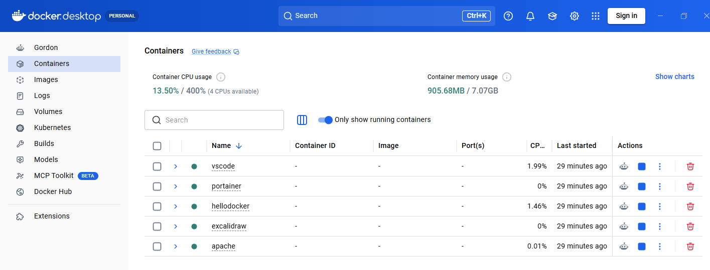
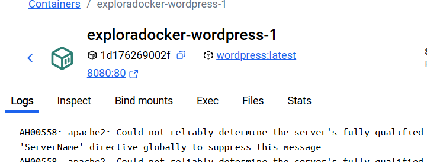
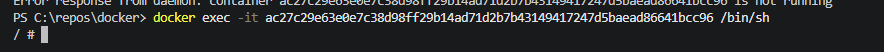

# Explora Docker

En esta práctica vamos a explorar tanto la aplicación Docker Desktop de windows y los comando más utilizados de Docker.

- [Explora Docker](#explora-docker)
  - [Indicaciones de entrega](#indicaciones-de-entrega)
  - [Antes de empezar](#antes-de-empezar)
  - [1. Contenedores](#1-contenedores)
  - [2. Imagenes](#2-imagenes)
  - [3. Volumenes](#3-volumenes)
  - [4. Administrando contendores](#4-administrando-contendores)


## Indicaciones de entrega

- Responde en este fichero con capturas o texto según se requiera.
- Utiliza el formato correcto para los bloques de comando si los hubiera
- Recuerda ir publicando los cambios de vez en cuando usando los comandos, ejemplo:
```bash
git add --all
git commit -m "ejericicios 2, 3, 4 y 5"
git push
```

## Antes de empezar

- Pon Docker en marcha y ejecuta el comando de docker compose en esta carpeta para levantar la maquina. 
```bash
docker-compose up -d
```

## 1. Contenedores

1.1 ¿ Dónde podemos ver los contendores en marcha en la aplicación Docker Desktop? (Captura)


1.2 Para ver los contendores en marcha desde la terminal se usa el comando `docker ps`, ejecutalo. (Captura)
```bash
docker ps
CONTAINER ID   IMAGE                                    COMMAND                  CREATED       STATUS                      PORTS                                         NAMES
0064caac3ee8   lscr.io/linuxserver/code-server:latest   "/init"                  6 days ago    Up 39 minutes               0.0.0.0:8443->8443/tcp, [::]:8443->8443/tcp   vscode-code-1
dfc9cb9ea42a   httpd:2.4-alpine                         "httpd-foreground"       6 days ago    Up 39 minutes (unhealthy)   0.0.0.0:8082->80/tcp, [::]:8082->80/tcp       apache
85043a22d2ef   portainer/portainer-ce:latest            "/portainer"             7 days ago    Up 39 minutes               0.0.0.0:9443->9443/tcp, [::]:9443->9443/tcp   portainer-portainer-1
ac27c29e63e0   excalidraw/excalidraw:latest             "/docker-entrypoint.…"   7 days ago    Up 39 minutes (healthy)     0.0.0.0:3030->80/tcp, [::]:3030->80/tcp       excalidraw
c97dd55643f8   phpmyadmin                               "/docker-entrypoint.…"   13 days ago   Up 39 minutes               0.0.0.0:8081->80/tcp, [::]:8081->80/tcp       hellodocker-phpmyadmin-1
c60c04c0d570   wordpress                                "docker-entrypoint.s…"   13 days ago   Up 39 minutes               0.0.0.0:8080->80/tcp, [::]:8080->80/tcp       hellodocker-wordpress-1
08a945060073   mysql:8.0                                "docker-entrypoint.s…"   13 days ago   Up 39 minutes               3306/tcp, 33060/tcp                           hellodocker-db-1
```

1.3 ¿Qué muestra el comando `docker container`?
```bash
docker container
``` 

Muestra el listado de opciones que se pueden hacer con ese comando + algun otro atributo.

1.4 ¿Qué muestra el comando `docker container ls`?
Es equivalente al docker ps, ya que muestra el listado de todos los contenedores que estan en ejeccion.


## 2. Imagenes

2.1 ¿Dónde podemos ver las imágenes que tenemos descargadas en la aplicación Docker Desktop? (Captura)
```bash
docker image ls
IMAGE                                    ID             DISK USAGE   CONTENT SIZE   EXTRA
excalidraw/excalidraw:latest             f7ee194addd6        143MB         43.3MB    U
httpd:2.4-alpine                         4e585da9d012       97.4MB         21.9MB    U
linuxserver/snapdrop:version-b8b78cc2    3e0af233372e        208MB         53.9MB    U
lscr.io/linuxserver/code-server:latest   6fb8bbaf3148        1.3GB          316MB    U
mysql:8.0                                7dcddc01f13b        1.1GB          249MB    U
phpmyadmin:latest                        5f4b9a1f5aa3        870MB          209MB    U
portainer/portainer-ce:latest            4d616db18cfe        201MB         45.4MB    U
wordpress:latest                         edeeae67330a       1.17GB          296MB    U
```


2.2 ¿Qué muestra el comando `docker images`?
Muestra una lista de todas las imagenes de Docker que estan descargadas de forma local en el equipo.


2.3 ¿Qué muestra el comando `docker image ls`
Exactamente lo mismo que Docker image.

## 3. Volumenes

3.1 ¿Dónde podemos ver los volumenes que tenemos en la aplicación Docker Desktop? (Captura)
En la pestaña de volumenes.

3.2 ¿Qué vemos en Docker Desktop si entramos en uno de los volumenes disponibles? (Captura)
Al entrar en un volumen podemos ver varias pestañas. Una de Data, in use y la de details.

3.3 ¿Qué muestra el comando `docker volume`?
Una lista de todas las opciones posibles con ese comando + otro subcomando. 

3.4 ¿Qué muestra el comando `docker volume ls`?
Una lista deque muestra todos los volumenes de Docker creados de forma local.


## 4. Administrando contendores

4.1 Si entramos en un contendor, verémos las siguientes pestañas. Las más importantes son **Logs**, **Exec** y **Files**. Explica para qué crees que sirve cada una.




**Logs:** Sirve para ver el historial de salida y los mensajes del sistema que genera el contenedor en tiempo real. 
**Exec:** Es una terminal interactiva directa integrada en la interfaz gráfica. 
**Files:** Funciona como un explorador de archivos visual del sistema interno del contenedor.

4.2 Si queremos ejecutar comandos dentro de un contendor podemos usar Docker Desktop o podemos utilizar el comando `docker exec`. 

Para abrir una terminal, podemos ejecutar el programa bash con el parámetro -it (t de terminal e i de Standard Input).


```bash
docker exec -it <NOMBRE CONTENDOR> bash
```

Ejecuta el comando y muestra una captura de la terminal dentro del contendor.


4.3 Apaga todos los contendores de este proyecto con el comando `docker compose down` (Captura)
